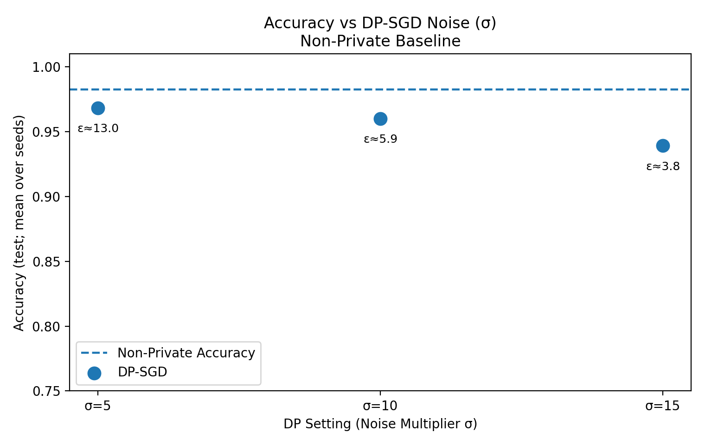

# 🧩 PrivBench — Unified Benchmarking Framework for Differential Privacy in ML

**PrivBench** is an open-source benchmarking framework that makes the **privacy–utility trade-off in machine learning measurable, transparent, and reproducible**.  
It extends traditional Differential Privacy (DP) evaluation by introducing four standardized dimensions: **Privacy Strength**, **Model Utility**, **Fairness**, and **Efficiency**.

---

## 🔍 Motivation

AI and ML models rely on massive amounts of data — often sensitive and personal.  
While Differential Privacy provides a mathematical guarantee of privacy protection, its **effectiveness and trade-offs** are rarely evaluated in a consistent way.

Current challenges:
- No standardized method to compare DP algorithms across datasets or models  
- Trade-offs between **privacy, accuracy, fairness, and efficiency** often hidden  
- Lack of practical tools to visualize and quantify the impact of DP noise  

**PrivBench** solves this by providing a unified, reproducible benchmarking pipeline.

---

## 🧠 Framework Overview

PrivBench evaluates ML models along **four key dimensions**:

| Dimension | Description |
|------------|-------------|
| **Privacy Strength** | Quantifies the privacy budget (ε, δ) and privacy leakage risk using membership inference (MIA AUC). |
| **Model Utility** | Measures how model performance (accuracy, ROC-AUC) changes as privacy noise increases. |
| **Fairness** | Evaluates whether DP noise causes disparities between groups (DPD & EOD metrics). |
| **Efficiency** | Tracks computational cost (training time, model size) under different DP settings. |

---

## 📊 Example Results

**Dataset:** Wisconsin Breast Cancer Dataset  
**Model:** Logistic Regression trained with DP-SGD  
**Noise multipliers (σ):** 1.0, 5.0, 10.0  
**δ:** 1e-5  

| Setting                | σ    | μ (approx) | Accuracy | ROC–AUC | Fairness (DPD / EOD) | Train Time (s) |
|-------------------------|------|-------------|-----------|---------|----------------------|----------------|
| Non-Private LR          | –    | ∞           | 0.9825    | 0.9990  | 0.3789 / 0.0109      | 0.0254         |
| DP-SGD LR (σ = 5.0)     | 5.0  | 12.9565     | 0.9684    | 0.9965  | 0.3562 / 0.0131      | 0.0155         |
| DP-SGD LR (σ = 10.0)    | 10.0 | 5.8782      | 0.9602    | 0.9902  | 0.3538 / 0.0175      | 0.0153         |
| DP-SGD LR (σ = 15.0)    | 15.0 | 3.7780      | 0.9392    | 0.9778  | 0.3438 / 0.0225      | 0.0136         |

🧾 *Higher σ → stronger privacy (lower ε) but reduced accuracy. Fairness gaps stay small.*

---

## 📈 Visualization

PrivBench automatically generates a **matplotlib plot** of accuracy vs. DP noise (σ), annotated with privacy budgets (ε).

<p align="center">
  
</p>

---

## Getting Started

1. Clone the repo

    ```bash
    git clone https://github.com/<yourusername>/PrivBench.git
    cd PrivBench
    ```

2. Set up your environment

    ```bash
    python3 -m venv .venv
    source .venv/bin/activate   # On Windows: .venv\Scripts\activate
    pip install -r requirements.txt
    ```

3. Run the benchmark

    ```bash
   python benchmark.py
    ```
4. View Ouputs

  Results CSV → dp_benchmark_full_metrics_avg.csv <br>
  Plot → acc_vs_sigma_with_baseline_avg.png


